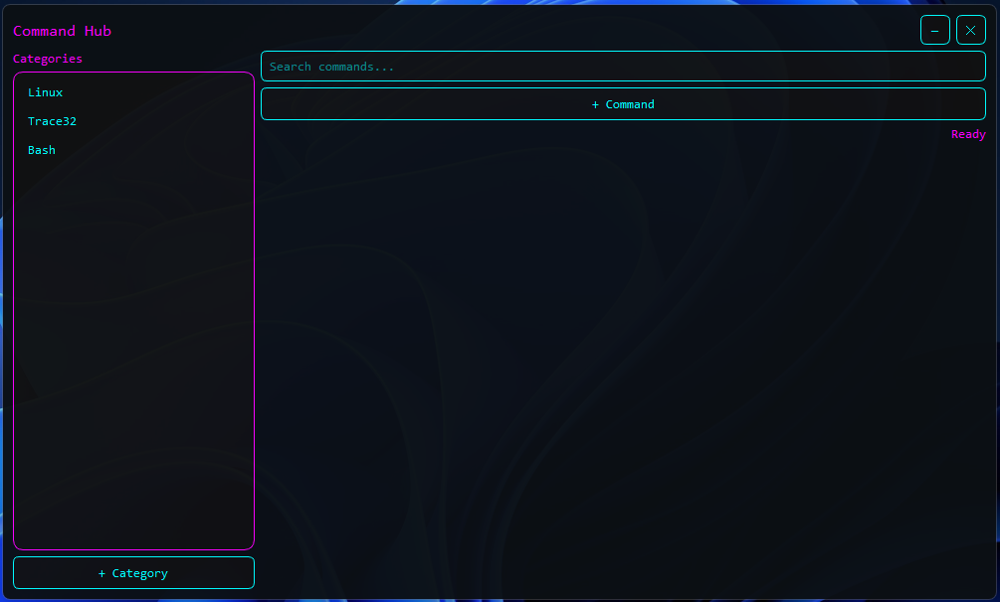
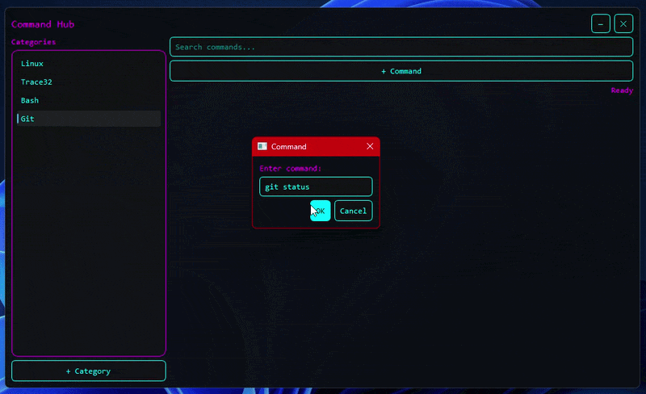

<div align="center">

# 🚀 Command Hub

**A modern Command Manager built with Python and PyQt6**

Organize your frequently used commands into categories and copy them to your clipboard with a single click.




</div>

---

# ✨ Features

* 🎯 Organize commands into categories
* 📋 One-click copy to clipboard
* 🔍 Instant command search
* 💾 Automatic JSON-based data storage
* 🎨 Modern cyber-themed UI
* 🚀 Lightweight and fast
* 🖥 Cross-platform (Windows, Linux, macOS)
* 📂 No database required

---

# 📷 Demo



---

# 📂 Project Structure

```text
CommandHub/
│
├── assets/
│   ├── screenshot.png
│   └── demo.gif
│
├── main.py
├── commands.json
├── requirements.txt
├── LICENSE
├── .gitignore
└── README.md
```

---

# 🛠 Requirements

* Python 3.10 or newer
* pip
* PyQt6

---

# 🚀 Installation

## 1. Clone the Repository

```bash
git clone https://github.com/YOUR_USERNAME/CommandHub.git
```

```bash
cd CommandHub
```

---

## 2. Create a Virtual Environment (Recommended)

### Windows

```bash
python -m venv venv
```

### Linux / macOS

```bash
python3 -m venv venv
```

---

## 3. Activate the Virtual Environment

### Windows (Command Prompt)

```bash
venv\Scripts\activate
```

### Windows (PowerShell)

```powershell
.\venv\Scripts\Activate.ps1
```

### Linux / macOS

```bash
source venv/bin/activate
```

---

## 4. Install Dependencies

```bash
pip install -r requirements.txt
```

---

## 5. Run the Application

```bash
python main.py
```

---

# 📖 How to Use

### Create a Category

Click the **+ Category** button and create categories such as:

* Git
* Docker
* Linux
* Python
* AUTOSAR
* Windows
* ADB

---

### Select a Category

Choose a category from the left panel.

---

### Add a Command

Click **+ Command**

Enter:

* Command Name
* Command

Example:

**Name**

```text
Git Pull
```

**Command**

```bash
git pull origin main
```

---

### Copy a Command

Click any command button.

The command is instantly copied to your clipboard.

Paste it anywhere using **Ctrl + V**.

---

### Search Commands

Use the search bar to instantly filter commands within the selected category.

---

# 💾 Data Storage

All data is stored locally inside:

```text
commands.json
```

Example:

```json
{
  "Git": [
    {
      "name": "Clone",
      "command": "git clone <repository-url>"
    },
    {
      "name": "Pull",
      "command": "git pull"
    }
  ]
}
```

No cloud storage.

No internet connection required.

Everything stays on your computer.

---

# 🛠 Technologies Used

* Python
* PyQt6
* Qt Widgets
* JSON

---

# 📋 Future Improvements

* Edit commands
* Delete commands
* Delete categories
* Import / Export JSON
* SQLite support
* Keyboard shortcuts
* Favorites
* Multi-line commands
* Command descriptions
* Dark / Light themes
* System tray support
* Global hotkeys

---

# ⚠ Common Issues

## Python is not recognized

Ensure Python is installed and **Add Python to PATH** was selected during installation.

---

## No module named PyQt6

Install the required dependency:

```bash
pip install -r requirements.txt
```

---

## Commands are not saved

Make sure the application has permission to create and modify:

```text
commands.json
```

---

# 🤝 Contributing

Contributions are always welcome.

If you have ideas for improvements:

1. Fork the repository.
2. Create a feature branch.
3. Commit your changes.
4. Open a Pull Request.

---

# 📺 YouTube Tutorial

A complete tutorial explaining how this application was built is available on my YouTube channel:

## **The Engineer's Treatment (TET)**

The video covers:

* Building the UI with PyQt6
* Creating a frameless desktop application
* Managing categories and commands
* JSON file handling
* Clipboard integration
* Custom styling using Qt Style Sheets (QSS)
* Running and extending the application

If you find this project useful, consider subscribing for more tutorials on:

* Python
* Desktop Applications
* Embedded Systems
* Automotive Software
* Productivity Tools

---

# ⭐ Support

If you found this project helpful:

* ⭐ Star this repository
* 🍴 Fork the project
* 📺 Subscribe to **The Engineer's Treatment (TET)**
* 🛠 Share it with fellow developers

Your support motivates me to create more open-source projects and educational content.

---

# 📄 License

This project is licensed under the **MIT License**.

See the **LICENSE** file for more information.

---

<div align="center">

### Happy Coding! 🚀

Made with ❤️ by **Vijay Bari**

</div>
